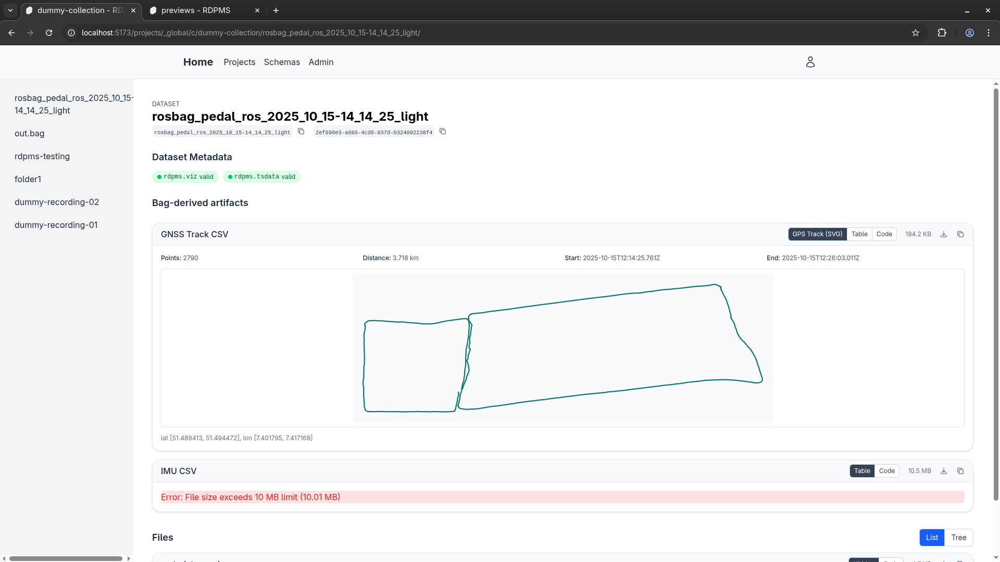

# Research Data and Pipeline Management System (RDPMS)



RDPMS is a project that follows a twofold approach: (1) it may store and process data that was collected especially in robotics and autonomous driving context and (2) may support sharing and tracking (for legal compliance reasons) of data across multiple instances.

The "tracking" may be implemented as "taint": it shall be clearly traceable, which parts (in time) of a dataset were processed to which datasets. Thus, a deletion request may be performed with minimal loss and effort.

## Repository layout

- `rdpms-backend/` .NET 9 API (ASP.NET Core + EF Core)
  - `RDPMS.Core.Contracts`: Shared contract types to describe file/container metadata and related structures, enabling reasoning over metadata across components.
  - `RDPMS.Core.Infra`: Cross-cutting infra
  - `RDPMS.Core.Persistence`: EF Core entities, DbContext, migrations
  - `RDPMS.Core.Server`: ASP.NET Core API
  - `RDPMS.Core.QueryEngine`: Metadata query DSL parser (JSON -> AST) and evaluator (AST -> JSON match)
- `rdpms-cli/` Python CLI client
- `rdpms-web-ui/` Svelte 5 + Vite 6 web UI
- `schemas/` JSON Schemas for shared contracts (see `schemas/README.md`)

## Quick start (dev)

### Dependencies

- .NET 9 SDK
- Node.js + npm
- Docker or Podman (plus a Podman VM if using Podman)

### Rider dev setup

The JetBrains Rider project is in `rdpms-backend/`. The "Full Dev-Stack" profile runs dependencies via the compose `deps` profile and runs the backend and web UI. If using a Podman VM, set the Engine API URL (unix socket path) in the IDE/plugin settings.

### CLI dev setup

#### Backend

Local run (seed DB and serve separately):

```bash
dotnet run --project rdpms-backend/src/RDPMS.Core.Server -- seed --init-db=dev
dotnet run --project rdpms-backend/src/RDPMS.Core.Server -- serve
```

Docker compose (dependencies or full stack):

```bash
docker compose -f rdpms-backend/compose.yaml --profile deps up
docker compose -f rdpms-backend/compose.yaml --profile full up
```

Note: `dev` only contains a static webserver and minio instance. `full` additionally spins up the .NET solution and a PostgreSQL-instance. `full` is WIP and still needs the UI started separately.

#### Web UI

```bash
cd rdpms-web-ui
npm install
npm run dev
```

UI default port: `http://localhost:5173`

#### CLI

The CLI is installed/run on the host (not in compose). Prefer a venv inside `rdpms-cli/`.

```bash
cd rdpms-cli
python -m venv .venv
source .venv/bin/activate
pip install --editable .
rdpms --help
```

## List of requirements and potentially planned features

Remarks:
- The current list does not include any requirements related to sharing data.
- "FSD" refers to a project and concepts by a group of Formula Student teams: ETH Zürich, TU Hamburg, KIT, NTNU Trondheim, Uni Bayreuth, and TU Dortmund.

| Enumeration | Requirement Text                                                                                | Priority |
|-------------|-------------------------------------------------------------------------------------------------|----------|
| A           | **General**                                                                                     |          |
| A.1         | Group multiple data files to a set (1:1, 1:many) [FSD A.1]                                      | HIGH     |
| A.2         | Search/Filter by existence of topics, content of topics, metadata [FSD 1.2]                     | MOD      |
| A.3         | Tagging data [FSD A.5]                                                                          | MOD      |
| A.4         | Grouping data (A.1) can be done by a plugin                                                     | MOD      |
| B           | **Pipeline-related. A pipeline consists of several jobs.**                                      |          |
| B.1         | Pipelines are executed on behalf of triggers                                                    | HIGH     |
| B.2         | Job-executors should be able to process any type of file                                        | HIGH     |
| B.3         | Triggers can be an upload [FSD B.1.IV]                                                          | HIGH     |
| B.4         | Triggers can be a plugin [FSD B.1.V]                                                            | HIGH     |
| B.5         | Triggers can be an arbitrary signal, like an API call                                           | HIGH     |
| B.6         | Triggers can be the setting of a tag                                                            | HIGH     |
| B.7         | Pipelines should be able to create content to be presented in the web interface [FSD B.1.I]     | HIGH     |
| B.8         | Pipeline execution                                                                              |          |
| B.8.1       | Pipelines consume data sets (incl. single files) and produce artifacts (also data sets?)        | HIGH     |
| B.8.2       | For efficiency reasons, input pipelines should exist, that directly process raw data on device. | MOD      |
| C           | **Backend**                                                                                     |          |
| C.1         | (Entire) system configuration should be file-based/readonly/non-runtime [FSD C.1]               |          |
| C.1.I       | Non-runtime configuration of connection info for file storages, S3-buckets, etc.                | T.B.D.   |
| C.1.II      | (Explicitly not?) Non-runtime configuration of pipelines                                        | T.B.D.   |
| C.2         | Should manage arbitrary amount of storage [FSD C.2]                                             | HIGH     |
| C.3         | "Flexible way" to add custom metadata [FSD C.6.I]                                               | T.B.D.   |
| C.4         | Storage of logs in S3 [FSD C.6.I]                                                               | MOD      |
| C.5         | Storage of logs in filesystem [FSD C.6.II]                                                      | T.B.D.   |
| C.6         | What about a dedicated/existing log management system?                                          | T.B.D.   |
| D           | **Web-based user interface**                                                                    |          |
| D.1         | Display artifacts (see point 2.f) [FSD D.2]                                                     | HIGH     |
| D.2         | Navigate logs [FSD D.1]                                                                         | LOW      |
| D.3         | Search for (user-defined) metadata [FSD D.3.I-III]                                              | LOW      |
| D.4         | Upload files via GUI (low priority) [FSD D.4.I]                                                 | MOD      |
| D.5         | Download files via GUI (low priority) [FSD D.4.II]                                              | MOD      |
| D.6         | Optimized downloading of data (only download the data we need) [FSD D.4.III]                    | LOW      |
| E           | **API-based interface**                                                                         |          |
| E.1         | Upload data via API [FSD E.1.I]                                                                 | MOD      |
| E.2         | Download data via API [FSD E.1.II]                                                              | HIGH     |
| E.3         | Optimized downloading of data (only download the data we need) [FSD E.1.IV]                     | LOW      |
| E.4         | Update Metadata [FSD E.3]                                                                       | MOD      |
| E.5         | CLI tool that wraps the API [FSD E.4]                                                           | LOW      |
| E.6         | Search and filtering functionality [FSD E.2.I-III]                                              | LOW      |
| F           | **Security**                                                                                    |          |
| F.1         | Support user/password authentication [FSD F.3.I]                                                | HIGH     |
| F.2         | Passkeys                                                                                        | LOW      |
| F.3         | Google/Microsoft accounts                                                                       | LOW      |
| F.4         | OAuth 2.0                                                                                       | LOW      |
| F.5         | Support permissions [FSD F.4]                                                                   |          |
| F.5.I       | Support users                                                                                   | HIGH     |
| F.5.II      | Support organizations                                                                           | T.B.D.   |
| F.5.III     | Support groups                                                                                  | LOW      |
| F.5.IV      | Support roles                                                                                   | LOW      |
| G           | **Supported file formats**                                                                      |          |
| G.1         | Base system should be file-type agnostic                                                        | HIGH     |
| G.2         | System should have a notion of file types through plugins [FSD G.4]                             | MOD      |
| G.3         | Bundled plugins should support                                                                  |          |
| G.3.I       | ROS1 (rosbag) [FSD G.1.I]                                                                       | HIGH     |
| G.3.II      | ROS2 (MCAP) [FSD G.1.II]                                                                        | HIGH     |
| G.3.III     | BLF (CAN) [FSD G.2.1]                                                                           | LOW      |
| G.3.IV      | MF4 (CAN) [FSD G.2.1]                                                                           | LOW      |
| G.4         | Metadata                                                                                        |          |
| G.4.I       | JSON/XML/YAML for custom metadata [FSD G.3.I-III]                                               | MOD      |
| G.4.II      | System should have a notion of types (e.g., ROS or CAN DBC message types)                       | T.B.D.   |
| H           | **Development**                                                                                 |          |
| H.1         | Plugin system for user-defined processing [FSD H.2] (Duplicate)                                 | HIGH     |
| H.2         | Should support schema change/plugin version change/upgrade [FSD H.3]                            | HIGH     |
| H.3         | System should facilitate migration from other platforms [FSD H.4]                               | LOW      |
| I           | **Deployment**                                                                                  |          |
| I.1         | System should run on cloud services [FSD I.2.I]                                                 | LOW      |
| I.2         | System should run on private cloud environments [FSD I.2.II]                                    | HIGH     |


## Developer Section

### Conventions

- All timestamps are UTC. Only on the visualization "layer", they may be converted to local time.


### Ambiguity of the Term Collection

tl;dr: The entity-type `DataCollectionEntity` and `System.Collections.CollectionBase` collide, so everytime an ambiguity might arise, we write `...CollectionEntity` (emphasizing **Entity**).

In the repository-world, the term collection is used for an entity containing multiple data sets. On the other hand, .NET features `System.Collections.CollectionBase`. The conflict is intensified by .NET's naming conventions about inheritance. If we want to create a list-like class that stores multiple instances of the `Something` class, we let it inherit from `CollectionBase` and name it `SomethingCollection`. So `DataCollection` and every other use of the Collection term suggest an inheritance from `CollectionBase`. So we name the repository-/entity-related _collection_ ```...CollectionEntity`, wherever an Ambiguity might arise.

### Important commands

add new migration:

```bash
dotnet ef migrations add -p RDPMS.Core.Persistence/RDPMS.Core.Persistence.csproj $INTEGRATION_NAME
```
